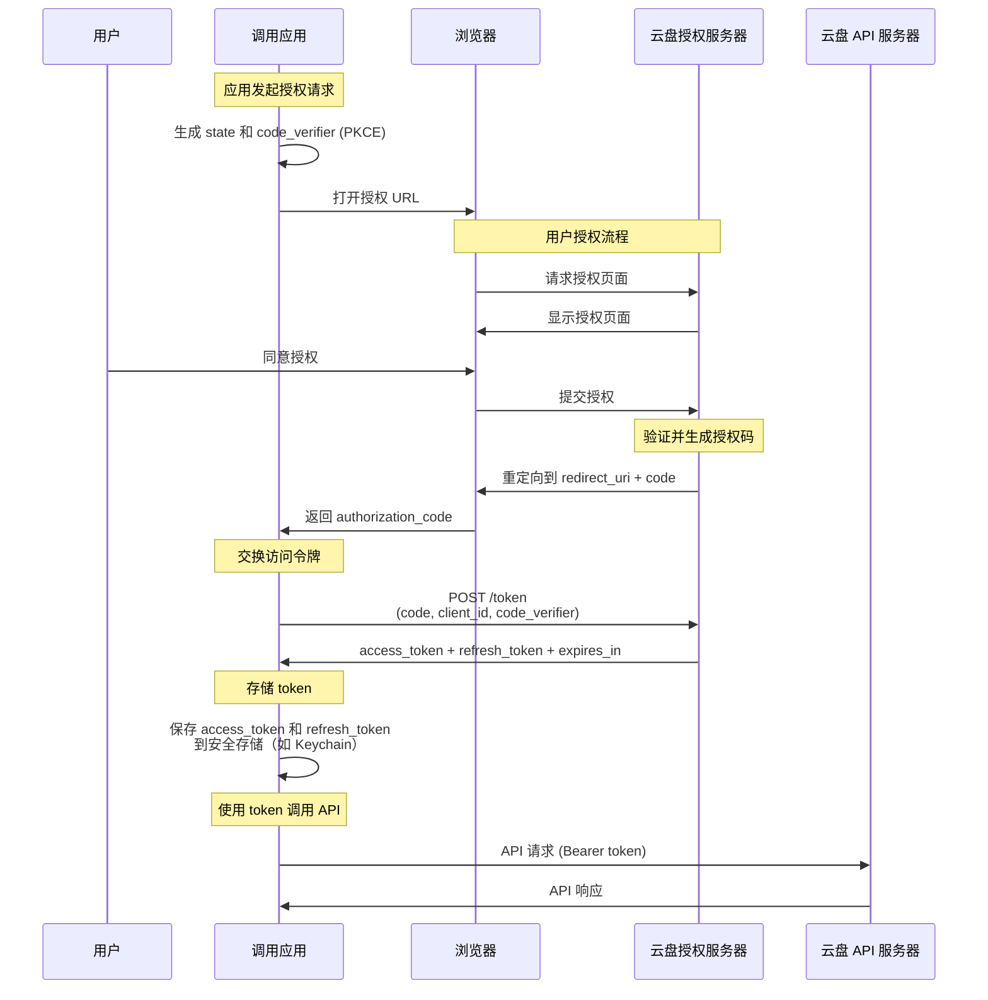
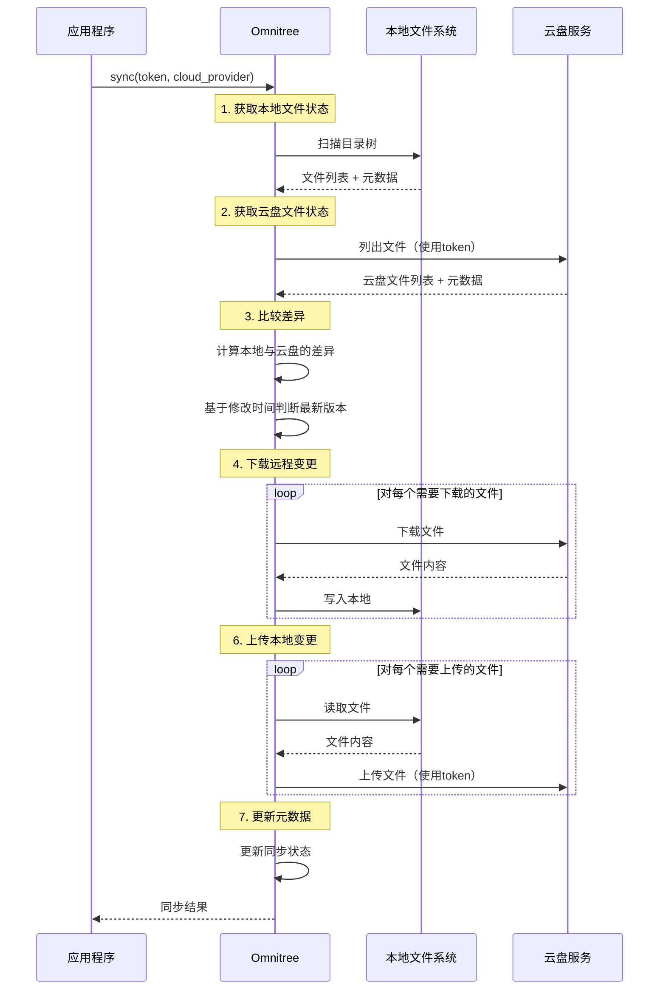
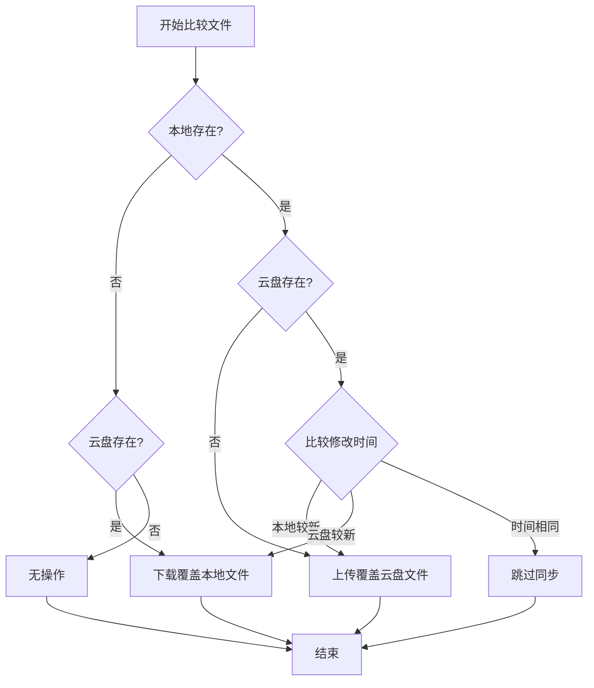

# Omnitree 设计文档

## 1. 概述

### 1.1 项目简介
本库是一个用 Rust 开发的跨平台本地文件同步库，核心目标是提供一个**可多设备、多端同步的本地文件目录树**。应用程序只需操作本地文件，库会在后台依托云盘（iCloud、OneDrive、Google Drive）实现跨设备的文件同步，让数据在用户的所有设备间保持一致。

### 1.2 设计目标
- **多设备同步**：提供跨设备、跨平台的文件目录树同步能力，数据在所有设备间保持一致
- **透明性**：应用层只需关注本地文件读写，无需感知云盘的存在
- **云盘依托**：依托主流云盘（iCloud、OneDrive、Google Drive）的存储能力，无需自建服务器
- **可控同步**：应用主动调用同步方法，控制同步时机，避免频繁网络操作
- **可靠性**：基于时间戳的简单同步策略，最新修改自动覆盖旧版本
- **高性能**：支持增量同步，减少网络开销，优化多设备间的数据传输

### 1.3 核心特性
- **本地优先**：提供标准的本地文件系统操作接口，保证应用流畅体验
- **多设备同步**：通过云盘作为中转，实现多设备间的文件自动同步
- **多云盘适配**：支持 iCloud、OneDrive、Google Drive，用户可选择熟悉的云盘服务
- **智能同步**：基于时间戳的双向同步，自动识别最新版本
- **增量传输**：仅同步变化的文件，优化网络使用
- **断点续传**：大文件传输支持断点续传，适应不稳定网络环境

## 2. 架构设计

### 2.1 整体架构


### 2.2 模块划分

#### 2.2.1 核心模块
- **API 层**：对外提供统一的本地文件操作接口
- **本地文件系统管理**：管理本地目录树和文件操作，提供应用透明的文件访问
- **同步引擎**：协调本地与云盘的同步逻辑，实现多设备间的数据一致性，基于时间戳判断最新版本
- **云盘适配器**：封装不同云盘的 API 差异，让库可以灵活支持多种云存储服务
- **元数据管理**：维护文件状态、修改时间等信息，支持增量同步和冲突检测

## 3. OAuth 授权与 Token 管理

### 3.1 OAuth 授权流程概述

本库**不负责**处理 OAuth 授权流程，所有的认证和 token 管理由**调用应用**负责。这是一个清晰的职责分离设计，使得库保持简洁和专注于核心的多设备文件同步功能。应用可以根据自己的需求完成 OAuth 授权，然后使用本库实现跨设备的文件同步。

### 3.2 应用侧的 OAuth 授权流程

调用应用需要在使用本库之前，自行完成 OAuth 授权并获取访问令牌。以下是标准的 OAuth 2.0 授权流程：



### 3.3 各云盘的 OAuth 参数

调用应用需要在各云盘平台注册应用以获取 OAuth 配置参数：

#### 3.3.1 OneDrive
- **注册平台**: Azure Portal
- **授权端点**: `https://login.microsoftonline.com/common/oauth2/v2.0/authorize`
- **令牌端点**: `https://login.microsoftonline.com/common/oauth2/v2.0/token`
- **所需权限**: `Files.ReadWrite`, `offline_access`
- **需要配置**: Client ID, Client Secret (可选), Redirect URI

#### 3.3.2 Google Drive
- **注册平台**: Google Cloud Console
- **授权端点**: `https://accounts.google.com/o/oauth2/v2/auth`
- **令牌端点**: `https://oauth2.googleapis.com/token`
- **所需权限**: `https://www.googleapis.com/auth/drive.file`, `https://www.googleapis.com/auth/drive.appdata`
- **需要配置**: Client ID, Client Secret, Redirect URI

#### 3.3.3 iCloud
- **注册平台**: Apple Developer
- **授权端点**: `https://appleid.apple.com/auth/authorize`
- **令牌端点**: `https://appleid.apple.com/auth/token`
- **所需权限**: `name`, `email`
- **需要配置**: Services ID, Team ID, Key ID, Private Key, Redirect URI

### 3.4 Token 管理要点

应用侧需要实现以下 token 管理功能：

1. **安全存储**: 使用系统密钥链（macOS Keychain、Windows Credential Manager、Linux Secret Service）存储 token
2. **过期检测**: 定期检查 token 是否过期或即将过期
3. **自动刷新**: 使用 refresh token 在 access token 过期前自动刷新（建议提前5分钟）
4. **刷新失败处理**: 当 refresh token 失效时，引导用户重新授权
5. **安全清理**: 用户登出时安全删除存储的 token

### 3.5 职责边界总结

| 职责 | 负责方 | 说明 |
|------|--------|------|
| OAuth 授权流程 | **调用应用** | 应用负责引导用户授权，获取 authorization code |
| Token 交换 | **调用应用** | 应用负责用 code 换取 access token 和 refresh token |
| Token 存储 | **调用应用** | 应用负责将 token 安全存储到系统密钥链 |
| Token 刷新 | **调用应用** | 应用负责在 token 过期前刷新 |
| Token 传递 | **调用应用** | 应用将有效的 access token 传递给库 |
| 文件同步 | **本库 (Omnitree)** | 库使用传入的 token 执行文件同步操作 |
| Token 验证 | **本库 (Omnitree)** | 库在使用 token 时会验证其有效性（通过 API 调用） |


## 4. 同步流程设计

### 4.1 同步流程图



### 4.2 文件状态判断逻辑



## 5. API 设计

### 5.1 核心结构体

```rust
/// 云盘提供商枚举
#[derive(Debug, Clone, PartialEq)]
pub enum CloudProvider {
    ICloud,
    OneDrive,
    GoogleDrive,
}

/// 认证信息
#[derive(Debug, Clone)]
pub struct CloudCredentials {
    /// OAuth 令牌
    pub token: String,
    /// 云盘提供商
    pub provider: CloudProvider,
    /// 可选：令牌过期时间
    pub expires_at: Option<std::time::SystemTime>,
    /// 可选：刷新令牌
    pub refresh_token: Option<String>,
}

/// 同步配置
#[derive(Debug, Clone)]
pub struct SyncConfig {
    /// 本地根目录路径
    pub local_root: PathBuf,
    /// 云盘根目录路径（相对于云盘根目录）
    pub remote_root: String,
    /// 是否启用增量同步
    pub incremental: bool,
    /// 忽略文件模式（如 .gitignore 格式）
    pub ignore_patterns: Vec<String>,
}

/// 同步结果
#[derive(Debug)]
pub struct SyncResult {
    /// 下载的文件数量
    pub downloaded: usize,
    /// 上传的文件数量
    pub uploaded: usize,
    /// 删除的文件数量
    pub deleted: usize,
    /// 跳过的文件数量
    pub skipped: usize,
    /// 错误列表
    pub errors: Vec<SyncError>,
    /// 同步耗时
    pub duration: std::time::Duration,
}

/// 同步错误
#[derive(Debug)]
pub struct SyncError {
    /// 文件路径
    pub path: Option<PathBuf>,
    /// 错误类型
    pub kind: SyncErrorKind,
    /// 错误消息
    pub message: String,
}

/// 错误类型
#[derive(Debug, Clone, PartialEq)]
pub enum SyncErrorKind {
    /// 网络错误
    Network,
    /// 认证错误
    Authentication,
    /// 权限错误
    Permission,
    /// 文件系统错误
    FileSystem,
    /// API 限流
    RateLimit,
    /// 其他错误
    Other,
}

/// 文件元数据
#[derive(Debug, Clone)]
pub struct FileMetadata {
    /// 文件路径
    pub path: PathBuf,
    /// 文件大小（字节）
    pub size: u64,
    /// 修改时间
    pub modified: std::time::SystemTime,
    /// 文件哈希（SHA256）
    pub hash: String,
    /// 是否为目录
    pub is_directory: bool,
}
```

### 5.2 主要 API

```rust
/// Omnitree 主结构体
pub struct Omnitree {
    config: SyncConfig,
    metadata_db: MetadataDatabase,
    sync_engine: SyncEngine,
}

impl Omnitree {
    /// 创建新的库实例
    /// 
    /// # 参数
    /// - `config`: 同步配置
    /// 
    /// # 返回
    /// - `Result<Self, Error>`: 成功返回实例，失败返回错误
    pub fn new(config: SyncConfig) -> Result<Self, Error>;

    /// 初始化本地目录（首次使用时调用）
    /// 
    /// # 返回
    /// - `Result<(), Error>`: 成功或错误
    pub fn initialize(&self) -> Result<(), Error>;

    /// 执行同步操作
    /// 
    /// # 参数
    /// - `credentials`: 云盘认证信息
    /// 
    /// # 返回
    /// - `Result<SyncResult, Error>`: 同步结果或错误
    pub fn sync(&mut self, credentials: &CloudCredentials) -> Result<SyncResult, Error>;

    /// 异步执行同步操作（推荐使用）
    /// 
    /// # 参数
    /// - `credentials`: 云盘认证信息
    /// 
    /// # 返回
    /// - `Result<SyncResult, Error>`: 同步结果或错误
    pub async fn sync_async(&mut self, credentials: &CloudCredentials) -> Result<SyncResult, Error>;

    // ========== 本地文件操作 API ==========

    /// 读取文件内容
    /// 
    /// # 参数
    /// - `path`: 相对于本地根目录的文件路径
    /// 
    /// # 返回
    /// - `Result<Vec<u8>, Error>`: 文件内容或错误
    pub fn read_file<P: AsRef<Path>>(&self, path: P) -> Result<Vec<u8>, Error>;

    /// 读取文件内容为字符串
    /// 
    /// # 参数
    /// - `path`: 相对于本地根目录的文件路径
    /// 
    /// # 返回
    /// - `Result<String, Error>`: 文件内容或错误
    pub fn read_file_to_string<P: AsRef<Path>>(&self, path: P) -> Result<String, Error>;

    /// 写入文件内容
    /// 
    /// # 参数
    /// - `path`: 相对于本地根目录的文件路径
    /// - `content`: 文件内容
    /// 
    /// # 返回
    /// - `Result<(), Error>`: 成功或错误
    pub fn write_file<P: AsRef<Path>>(&mut self, path: P, content: &[u8]) -> Result<(), Error>;

    /// 创建目录
    /// 
    /// # 参数
    /// - `path`: 相对于本地根目录的目录路径
    /// 
    /// # 返回
    /// - `Result<(), Error>`: 成功或错误
    pub fn create_dir<P: AsRef<Path>>(&mut self, path: P) -> Result<(), Error>;

    /// 删除文件
    /// 
    /// # 参数
    /// - `path`: 相对于本地根目录的文件路径
    /// 
    /// # 返回
    /// - `Result<(), Error>`: 成功或错误
    pub fn delete_file<P: AsRef<Path>>(&mut self, path: P) -> Result<(), Error>;

    /// 删除目录（递归）
    /// 
    /// # 参数
    /// - `path`: 相对于本地根目录的目录路径
    /// 
    /// # 返回
    /// - `Result<(), Error>`: 成功或错误
    pub fn delete_dir<P: AsRef<Path>>(&mut self, path: P) -> Result<(), Error>;

    /// 列出目录内容
    /// 
    /// # 参数
    /// - `path`: 相对于本地根目录的目录路径
    /// 
    /// # 返回
    /// - `Result<Vec<FileMetadata>, Error>`: 文件列表或错误
    pub fn list_dir<P: AsRef<Path>>(&self, path: P) -> Result<Vec<FileMetadata>, Error>;

    /// 检查文件是否存在
    /// 
    /// # 参数
    /// - `path`: 相对于本地根目录的文件路径
    /// 
    /// # 返回
    /// - `bool`: 是否存在
    pub fn exists<P: AsRef<Path>>(&self, path: P) -> bool;

    /// 获取文件元数据
    /// 
    /// # 参数
    /// - `path`: 相对于本地根目录的文件路径
    /// 
    /// # 返回
    /// - `Result<FileMetadata, Error>`: 文件元数据或错误
    pub fn get_metadata<P: AsRef<Path>>(&self, path: P) -> Result<FileMetadata, Error>;

    /// 移动/重命名文件
    /// 
    /// # 参数
    /// - `from`: 源路径
    /// - `to`: 目标路径
    /// 
    /// # 返回
    /// - `Result<(), Error>`: 成功或错误
    pub fn rename<P: AsRef<Path>>(&mut self, from: P, to: P) -> Result<(), Error>;

    /// 复制文件
    /// 
    /// # 参数
    /// - `from`: 源路径
    /// - `to`: 目标路径
    /// 
    /// # 返回
    /// - `Result<(), Error>`: 成功或错误
    pub fn copy<P: AsRef<Path>>(&self, from: P, to: P) -> Result<(), Error>;

    // ========== 同步状态查询 API ==========

    /// 获取文件的同步状态
    /// 
    /// # 参数
    /// - `path`: 相对于本地根目录的文件路径
    /// 
    /// # 返回
    /// - `Result<SyncStatus, Error>`: 同步状态或错误
    pub fn get_sync_status<P: AsRef<Path>>(&self, path: P) -> Result<SyncStatus, Error>;

    /// 获取上次同步时间
    /// 
    /// # 返回
    /// - `Option<std::time::SystemTime>`: 上次同步时间
    pub fn last_sync_time(&self) -> Option<std::time::SystemTime>;

    /// 检查是否有待同步的更改
    /// 
    /// # 返回
    /// - `Result<bool, Error>`: 是否有待同步的更改
    pub fn has_pending_changes(&self) -> Result<bool, Error>;

    /// 获取待同步的文件列表
    /// 
    /// # 返回
    /// - `Result<Vec<PathBuf>, Error>`: 待同步的文件列表
    pub fn get_pending_files(&self) -> Result<Vec<PathBuf>, Error>;

    // ========== 配置管理 API ==========

    /// 更新同步配置
    /// 
    /// # 参数
    /// - `config`: 新的同步配置
    /// 
    /// # 返回
    /// - `Result<(), Error>`: 成功或错误
    pub fn update_config(&mut self, config: SyncConfig) -> Result<(), Error>;

    /// 获取当前配置
    /// 
    /// # 返回
    /// - `&SyncConfig`: 当前配置的引用
    pub fn get_config(&self) -> &SyncConfig;

    /// 添加忽略模式
    /// 
    /// # 参数
    /// - `pattern`: 忽略模式（如 "*.tmp", ".DS_Store"）
    /// 
    /// # 返回
    /// - `Result<(), Error>`: 成功或错误
    pub fn add_ignore_pattern(&mut self, pattern: String) -> Result<(), Error>;

    // ========== 清理和维护 API ==========

    /// 清理本地缓存和临时文件
    /// 
    /// # 返回
    /// - `Result<(), Error>`: 成功或错误
    pub fn cleanup(&self) -> Result<(), Error>;

    /// 重建元数据索引（在数据损坏时使用）
    /// 
    /// # 返回
    /// - `Result<(), Error>`: 成功或错误
    pub fn rebuild_index(&mut self) -> Result<(), Error>;

    /// 验证本地文件完整性
    /// 
    /// # 返回
    /// - `Result<Vec<PathBuf>, Error>`: 损坏的文件列表
    pub fn verify_integrity(&self) -> Result<Vec<PathBuf>, Error>;
}

/// 文件同步状态
#[derive(Debug, Clone, PartialEq)]
pub enum SyncStatus {
    /// 已同步，无变化
    Synced,
    /// 本地有更改，待上传
    LocalModified,
    /// 云盘有更改，待下载
    RemoteModified,
    /// 未同步（新文件）
    NotSynced,
    /// 同步中
    Syncing,
}
```

## 6. 实现细节

### 6.1 元数据存储方案

本库使用 **SQLite** 作为元数据存储方案，它提供了功能强大、成熟稳定的数据库能力。

#### 6.1.1 数据库表结构

**文件元数据表 (files)**

| 字段名 | 类型 | 约束 | 说明 |
|--------|------|------|------|
| path | TEXT | PRIMARY KEY NOT NULL | 文件路径（相对路径） |
| size | INTEGER | NOT NULL | 文件大小（字节） |
| modified_time | INTEGER | NOT NULL | 最后修改时间（Unix 时间戳） |
| is_directory | BOOLEAN | NOT NULL | 是否为目录 |
| sync_status | TEXT | NOT NULL | 同步状态（Synced/LocalModified/RemoteModified/NotSynced/Syncing） |
| last_sync_time | INTEGER | NULL | 上次同步时间（Unix 时间戳） |
| remote_id | TEXT | NULL | 云盘文件 ID |

**同步历史表 (sync_history)**

| 字段名 | 类型 | 约束 | 说明 |
|--------|------|------|------|
| sync_time | INTEGER | PRIMARY KEY | 同步时间（Unix 时间戳） |
| cloud_provider | TEXT | NOT NULL | 云盘提供商（iCloud/OneDrive/GoogleDrive） |
| downloaded | INTEGER | NOT NULL | 下载文件数量 |
| uploaded | INTEGER | NOT NULL | 上传文件数量 |
| deleted | INTEGER | NOT NULL | 删除文件数量 |
| errors | INTEGER | NOT NULL | 错误数量 |
| duration_ms | INTEGER | NOT NULL | 同步耗时（毫秒） |

#### 6.1.2 索引

```sql
-- 按同步状态查询（用于获取待同步文件列表）
CREATE INDEX idx_sync_status ON files(sync_status);

-- 按修改时间查询（用于增量同步）
CREATE INDEX idx_modified_time ON files(modified_time);
```

#### 6.1.3 SQL 定义

```sql
-- 文件元数据表
CREATE TABLE files (
    path TEXT PRIMARY KEY NOT NULL,
    size INTEGER NOT NULL,
    modified_time INTEGER NOT NULL,
    is_directory BOOLEAN NOT NULL,
    sync_status TEXT NOT NULL,
    last_sync_time INTEGER,
    remote_id TEXT
);

-- 同步历史表
CREATE TABLE sync_history (
    sync_time INTEGER PRIMARY KEY,
    cloud_provider TEXT NOT NULL,
    downloaded INTEGER NOT NULL,
    uploaded INTEGER NOT NULL,
    deleted INTEGER NOT NULL,
    errors INTEGER NOT NULL,
    duration_ms INTEGER NOT NULL
);

-- 索引
CREATE INDEX idx_sync_status ON files(sync_status);
CREATE INDEX idx_modified_time ON files(modified_time);
```

**依赖添加：**
```toml
[dependencies]
rusqlite = { version = "0.30", features = ["bundled"] }
```

### 6.2 云盘适配器接口

```rust
/// 云盘适配器 trait（所有云盘实现此接口）
#[async_trait]
pub trait CloudAdapter: Send + Sync {
    /// 认证并初始化连接
    async fn authenticate(&mut self, credentials: &CloudCredentials) -> Result<(), Error>;

    /// 列出远程目录内容
    async fn list_remote(&self, path: &str) -> Result<Vec<RemoteFileInfo>, Error>;

    /// 下载文件
    async fn download_file(&self, remote_path: &str, local_path: &Path) -> Result<(), Error>;

    /// 上传文件
    async fn upload_file(&self, local_path: &Path, remote_path: &str) -> Result<(), Error>;

    /// 删除远程文件
    async fn delete_remote(&self, path: &str) -> Result<(), Error>;

    /// 创建远程目录
    async fn create_remote_dir(&self, path: &str) -> Result<(), Error>;

    /// 获取文件元数据
    async fn get_remote_metadata(&self, path: &str) -> Result<RemoteFileInfo, Error>;

    /// 检查连接状态
    async fn check_connection(&self) -> Result<bool, Error>;
}

/// 远程文件信息
#[derive(Debug, Clone)]
pub struct RemoteFileInfo {
    pub path: String,
    pub size: u64,
    pub modified: std::time::SystemTime,
    pub is_directory: bool,
    pub remote_id: String,
    pub hash: Option<String>,
}
```

### 6.3 哈希计算

使用 SHA256 计算文件哈希，用于快速比较文件是否变化：

```rust
use sha2::{Sha256, Digest};
use std::fs::File;
use std::io::Read;

pub fn calculate_file_hash(path: &Path) -> Result<String, Error> {
    let mut file = File::open(path)?;
    let mut hasher = Sha256::new();
    let mut buffer = [0u8; 8192];
    
    loop {
        let n = file.read(&mut buffer)?;
        if n == 0 {
            break;
        }
        hasher.update(&buffer[..n]);
    }
    
    Ok(format!("{:x}", hasher.finalize()))
}
```

## 7. 使用示例

### 7.1 基本使用流程

```rust
use omnitree::{
    Omnitree, SyncConfig, CloudCredentials, CloudProvider
};
use std::path::PathBuf;

#[tokio::main]
async fn main() -> Result<(), Box<dyn std::error::Error>> {
    // 1. 配置库
    let config = SyncConfig {
        local_root: PathBuf::from("/path/to/local/folder"),
        remote_root: "MyApp".to_string(),
        incremental: true,
        ignore_patterns: vec![
            "*.tmp".to_string(),
            ".DS_Store".to_string(),
            "node_modules/".to_string(),
        ],
    };

    // 2. 创建库实例
    let mut sync_lib = Omnitree::new(config)?;

    // 3. 初始化（首次使用）
    sync_lib.initialize()?;

    // 4. 准备云盘凭证（由应用通过 OAuth 获取）
    let credentials = CloudCredentials {
        token: "your_oauth_token_here".to_string(),
        provider: CloudProvider::OneDrive,
        expires_at: None,
        refresh_token: None,
    };

    // 5. 执行同步
    let result = sync_lib.sync_async(&credentials).await?;
    
    println!("同步完成:");
    println!("  下载: {} 个文件", result.downloaded);
    println!("  上传: {} 个文件", result.uploaded);
    println!("  耗时: {:?}", result.duration);

    // 6. 使用本地文件操作（完全透明，像操作普通文件一样）
    sync_lib.write_file("notes.txt", b"Hello, World!")?;
    let content = sync_lib.read_file_to_string("notes.txt")?;
    println!("文件内容: {}", content);

    // 7. 再次同步，将本地更改上传到云盘（其他设备可以同步下来）
    let result2 = sync_lib.sync_async(&credentials).await?;
    println!("第二次同步完成: 上传 {} 个文件", result2.uploaded);
    println!("提示: 现在可以在其他设备上同步这些文件了！");

    Ok(())
}
```

### 7.2 多设备同步场景

```rust
// 场景：用户在电脑 A 上修改文件，在电脑 B 上同步下来

// 电脑 A：修改文件并同步到云盘
let mut sync_lib_a = Omnitree::new(config_a)?;
sync_lib_a.write_file("document.txt", b"Updated content")?
sync_lib_a.sync_async(&credentials).await?;  // 上传到云盘

// 电脑 B：从云盘同步最新文件
let mut sync_lib_b = Omnitree::new(config_b)?;
sync_lib_b.sync_async(&credentials).await?;  // 下载最新版本
let content = sync_lib_b.read_file_to_string("document.txt")?;
assert_eq!(content, "Updated content");  // 获得电脑 A 的更改
```

### 7.3 多云盘支持

```rust
// 用户可以选择不同的云盘服务
let onedrive_creds = CloudCredentials {
    token: "onedrive_token".to_string(),
    provider: CloudProvider::OneDrive,
    expires_at: None,
    refresh_token: None,
};

let icloud_creds = CloudCredentials {
    token: "icloud_token".to_string(),
    provider: CloudProvider::ICloud,
    expires_at: None,
    refresh_token: None,
};

// 用户可以根据偏好选择不同的云盘服务
// 例如：Apple 用户使用 iCloud，Windows 用户使用 OneDrive
let result1 = sync_lib.sync_async(&onedrive_creds).await?;
println!("OneDrive 同步完成 - Windows/跨平台设备间同步");

let result2 = sync_lib.sync_async(&icloud_creds).await?;
println!("iCloud 同步完成 - Apple 生态设备间同步");
```

## 8. 项目结构

```
omnitree/
├── Cargo.toml
├── src/
│   ├── lib.rs                 # 库入口，导出公共 API
│   ├── error.rs               # 错误定义
│   ├── config.rs              # 配置结构
│   ├── types.rs               # 公共类型定义
│   │
│   ├── fs/                    # 本地文件系统模块
│   │   ├── mod.rs
│   │   ├── operations.rs      # 文件操作实现
│   │   └── metadata.rs        # 元数据管理
│   │
│   ├── db/                    # 数据库模块
│   │   ├── mod.rs
│   │   ├── schema.rs          # 数据库 schema
│   │   └── queries.rs         # 数据库查询
│   │
│   ├── sync/                  # 同步引擎模块
│   │   ├── mod.rs
│   │   ├── engine.rs          # 同步引擎主逻辑
│   │   └── diff.rs            # 差异计算
│   │
│   ├── adapters/              # 云盘适配器模块
│   │   ├── mod.rs
│   │   ├── trait.rs           # CloudAdapter trait 定义
│   │   ├── icloud.rs          # iCloud 适配器
│   │   ├── onedrive.rs        # OneDrive 适配器
│   │   └── gdrive.rs          # Google Drive 适配器
│   │
│   └── utils/                 # 工具模块
│       ├── mod.rs
│       ├── hash.rs            # 哈希计算
│       └── path.rs            # 路径处理
│
├── examples/                  # 示例代码
│   ├── basic_usage.rs
│   └── multi_cloud.rs
│
└── tests/                     # 集成测试
    ├── sync_tests.rs
    └── fs_tests.rs
```

## 9. 安全性考虑

### 9.1 令牌安全
- **不存储令牌**：库本身不持久化存储任何令牌，所有令牌由调用应用管理
- **内存保护**：使用 `zeroize` crate 在不再需要时清除内存中的敏感数据
- **HTTPS Only**：所有云盘 API 调用强制使用 HTTPS

### 9.2 文件安全
- **权限检查**：在操作文件前检查读写权限
- **路径验证**：防止路径遍历攻击（检查 `..` 等）
- **原子操作**：使用临时文件+重命名保证写入的原子性

### 9.3 数据完整性
- **哈希校验**：上传和下载后验证文件哈希
- **事务操作**：数据库操作使用事务保证一致性
- **备份机制**：同步前备份元数据数据库

## 10. 性能优化

### 10.1 增量同步
- 仅同步有变化的文件
- 使用文件哈希快速判断是否需要传输
- 支持断点续传（大文件）

### 10.2 并发控制
- 使用 tokio 进行异步 I/O
- 限制并发下载/上传数量（避免 API 限流）
- 批量操作减少 API 调用次数
