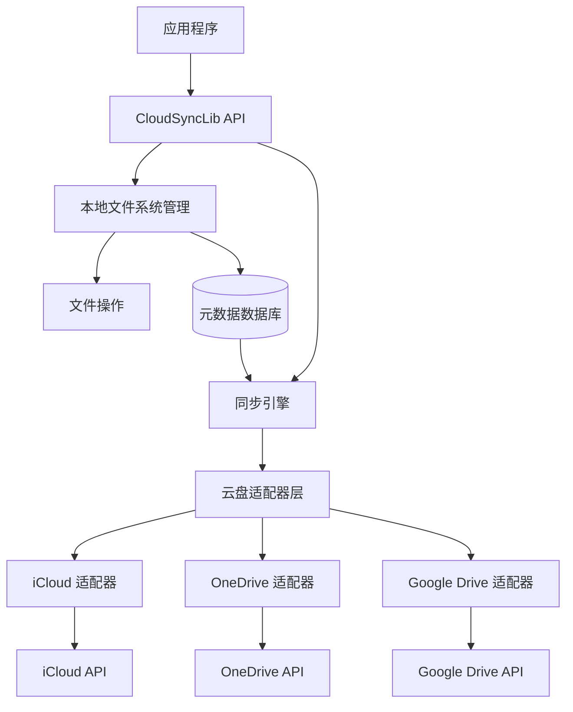
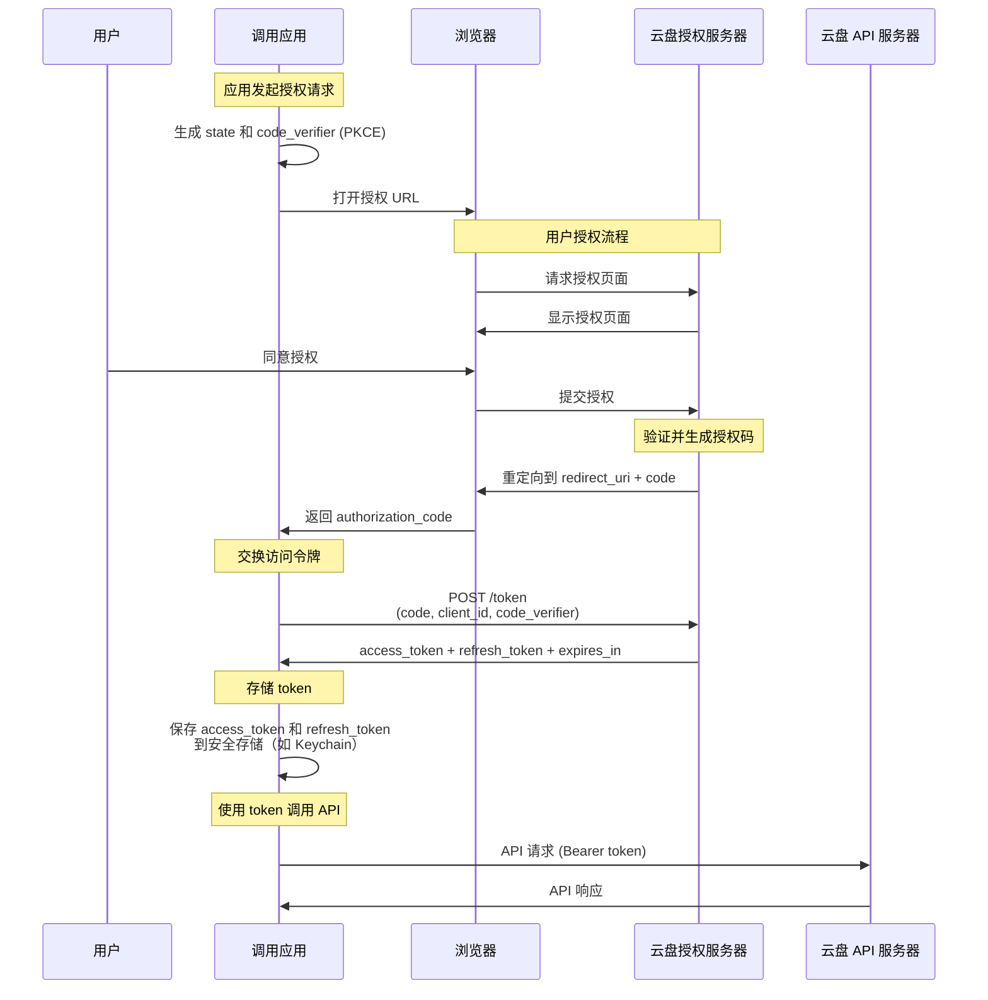
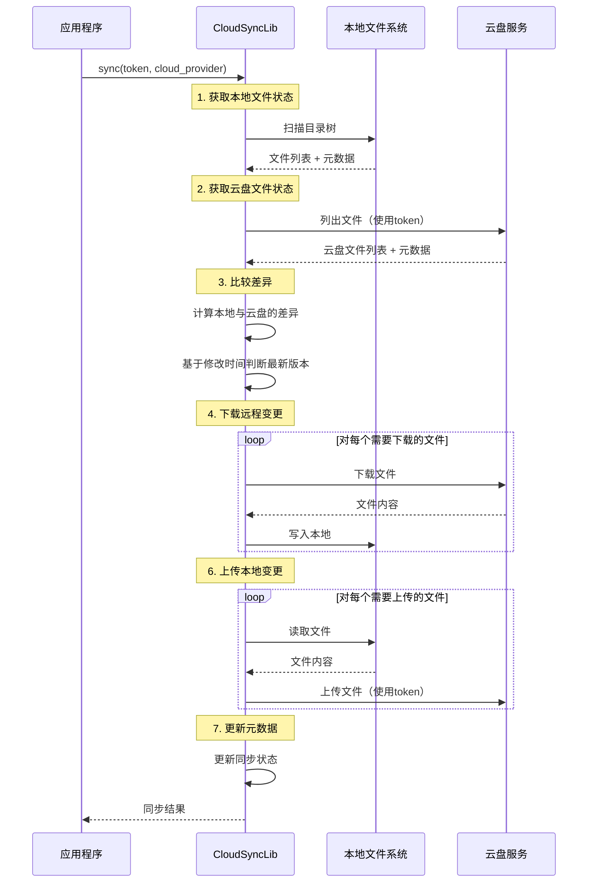
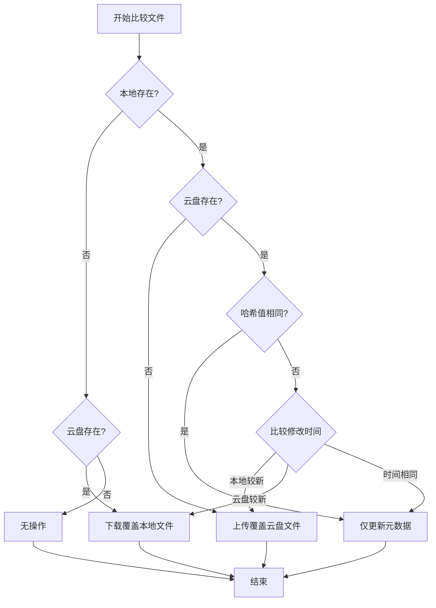

# 云盘同步库设计文档

## 1. 概述

### 1.1 项目简介
本库是一个用 Rust 开发的跨平台云盘同步库，旨在为应用程序提供透明的本地文件读写能力，同时在后台自动管理与多个云盘服务（iCloud、OneDrive、Google Drive）的文件同步。

### 1.2 设计目标
- **透明性**：应用层只需关注本地文件读写，无需感知云盘的存在
- **多云支持**：支持 iCloud、OneDrive、Google Drive 等主流云盘
- **可控同步**：应用主动调用同步方法，控制同步时机
- **可靠性**：基于时间戳的简单同步策略，最新修改自动覆盖旧版本
- **高性能**：支持增量同步，减少网络开销

### 1.3 核心特性
- 本地文件系统抽象
- 多云盘适配器架构
- 双向同步（上传/下载）
- 基于时间戳的智能同步
- 断点续传支持

## 2. 架构设计

### 2.1 整体架构



### 2.2 模块划分

#### 2.2.1 核心模块
- **API 层**：对外提供统一接口
- **本地文件系统管理**：管理本地目录树和文件操作
- **同步引擎**：协调本地与云盘的同步逻辑，基于时间戳判断最新版本
- **云盘适配器**：封装不同云盘的 API 差异
- **元数据管理**：维护文件状态、修改时间等信息

## 3. OAuth 授权与 Token 管理

### 3.1 OAuth 授权流程概述

本库**不负责**处理 OAuth 授权流程，所有的认证和 token 管理由**调用应用**负责。这是一个清晰的职责分离设计，使得库保持简洁和专注于文件同步功能。

### 3.2 应用侧的 OAuth 授权流程

调用应用需要在使用本库之前，自行完成 OAuth 授权并获取访问令牌。以下是标准的 OAuth 2.0 授权流程：



### 3.3 各云盘的 OAuth 配置

#### 3.3.1 OneDrive OAuth 配置

```rust
// 示例：OneDrive OAuth 参数
const ONEDRIVE_AUTH_URL: &str = "https://login.microsoftonline.com/common/oauth2/v2.0/authorize";
const ONEDRIVE_TOKEN_URL: &str = "https://login.microsoftonline.com/common/oauth2/v2.0/token";
const ONEDRIVE_SCOPES: &[&str] = &["Files.ReadWrite", "offline_access"];

// 应用需要在 Azure Portal 注册获取
struct OneDriveConfig {
    client_id: String,      // 应用 ID
    client_secret: String,  // 应用密钥（可选，使用 PKCE 时不需要）
    redirect_uri: String,   // 重定向 URI
}
```

#### 3.3.2 Google Drive OAuth 配置

```rust
// 示例：Google Drive OAuth 参数
const GDRIVE_AUTH_URL: &str = "https://accounts.google.com/o/oauth2/v2/auth";
const GDRIVE_TOKEN_URL: &str = "https://oauth2.googleapis.com/token";
const GDRIVE_SCOPES: &[&str] = &[
    "https://www.googleapis.com/auth/drive.file",
    "https://www.googleapis.com/auth/drive.appdata"
];

// 应用需要在 Google Cloud Console 注册获取
struct GoogleDriveConfig {
    client_id: String,
    client_secret: String,
    redirect_uri: String,
}
```

#### 3.3.3 iCloud OAuth 配置

```rust
// 示例：iCloud OAuth 参数
const ICLOUD_AUTH_URL: &str = "https://appleid.apple.com/auth/authorize";
const ICLOUD_TOKEN_URL: &str = "https://appleid.apple.com/auth/token";
const ICLOUD_SCOPES: &[&str] = &["name", "email"];

// 应用需要在 Apple Developer 注册获取
struct ICloudConfig {
    client_id: String,      // Services ID
    team_id: String,        // Team ID
    key_id: String,         // Key ID
    private_key: String,    // 私钥
    redirect_uri: String,
}
```

### 3.4 Token 存储与管理

应用需要安全地存储和管理获取到的 token：

```rust
use keyring::Entry;
use serde::{Deserialize, Serialize};
use std::time::{SystemTime, Duration};

/// Token 信息（应用侧管理）
#[derive(Debug, Clone, Serialize, Deserialize)]
pub struct TokenInfo {
    /// 访问令牌
    pub access_token: String,
    /// 刷新令牌
    pub refresh_token: Option<String>,
    /// 过期时间
    pub expires_at: SystemTime,
    /// 云盘提供商
    pub provider: String,
    /// 用户标识
    pub user_id: String,
}

/// Token 管理器（应用侧实现）
pub struct TokenManager {
    app_name: String,
}

impl TokenManager {
    pub fn new(app_name: &str) -> Self {
        Self {
            app_name: app_name.to_string(),
        }
    }
    
    /// 保存 token 到系统密钥链
    pub fn save_token(&self, user_id: &str, provider: &str, token: &TokenInfo) -> Result<(), Error> {
        let key = format!("{}:{}:{}", self.app_name, provider, user_id);
        let entry = Entry::new(&self.app_name, &key)?;
        let token_json = serde_json::to_string(token)?;
        entry.set_password(&token_json)?;
        Ok(())
    }
    
    /// 从系统密钥链读取 token
    pub fn load_token(&self, user_id: &str, provider: &str) -> Result<TokenInfo, Error> {
        let key = format!("{}:{}:{}", self.app_name, provider, user_id);
        let entry = Entry::new(&self.app_name, &key)?;
        let token_json = entry.get_password()?;
        let token: TokenInfo = serde_json::from_str(&token_json)?;
        Ok(token)
    }
    
    /// 删除 token
    pub fn delete_token(&self, user_id: &str, provider: &str) -> Result<(), Error> {
        let key = format!("{}:{}:{}", self.app_name, provider, user_id);
        let entry = Entry::new(&self.app_name, &key)?;
        entry.delete_password()?;
        Ok(())
    }
    
    /// 检查 token 是否过期
    pub fn is_token_expired(&self, token: &TokenInfo) -> bool {
        SystemTime::now() >= token.expires_at
    }
    
    /// 刷新 token（需要调用云盘 API）
    pub async fn refresh_token(&self, token: &TokenInfo) -> Result<TokenInfo, Error> {
        // 根据不同的 provider 调用相应的刷新 API
        match token.provider.as_str() {
            "OneDrive" => self.refresh_onedrive_token(token).await,
            "GoogleDrive" => self.refresh_gdrive_token(token).await,
            "iCloud" => self.refresh_icloud_token(token).await,
            _ => Err(Error::UnsupportedProvider),
        }
    }
    
    async fn refresh_onedrive_token(&self, token: &TokenInfo) -> Result<TokenInfo, Error> {
        // 实现 OneDrive token 刷新逻辑
        // POST https://login.microsoftonline.com/common/oauth2/v2.0/token
        // 参数：refresh_token, client_id, grant_type=refresh_token
        todo!("实现 OneDrive token 刷新")
    }
    
    async fn refresh_gdrive_token(&self, token: &TokenInfo) -> Result<TokenInfo, Error> {
        // 实现 Google Drive token 刷新逻辑
        // POST https://oauth2.googleapis.com/token
        // 参数：refresh_token, client_id, client_secret, grant_type=refresh_token
        todo!("实现 Google Drive token 刷新")
    }
    
    async fn refresh_icloud_token(&self, token: &TokenInfo) -> Result<TokenInfo, Error> {
        // 实现 iCloud token 刷新逻辑
        todo!("实现 iCloud token 刷新")
    }
}
```

### 3.5 应用集成示例

以下是应用如何集成 OAuth 授权和本库的完整示例：

```rust
use cloud_sync_lib::{CloudSyncLib, SyncConfig, CloudCredentials, CloudProvider};
use oauth2::{
    AuthUrl, ClientId, ClientSecret, CsrfToken, PkceCodeChallenge, RedirectUrl,
    Scope, TokenUrl, AuthorizationCode, TokenResponse, RefreshToken,
};
use oauth2::basic::BasicClient;
use oauth2::reqwest::async_http_client;
use std::path::PathBuf;

/// 应用的 OAuth 管理器
struct AppOAuthManager {
    token_manager: TokenManager,
    oauth_configs: HashMap<String, OAuthConfig>,
}

impl AppOAuthManager {
    /// 初始化 OAuth 客户端
    fn create_oauth_client(&self, provider: &str) -> Result<BasicClient, Error> {
        let config = self.oauth_configs.get(provider)
            .ok_or(Error::UnsupportedProvider)?;
        
        let client = BasicClient::new(
            ClientId::new(config.client_id.clone()),
            Some(ClientSecret::new(config.client_secret.clone())),
            AuthUrl::new(config.auth_url.clone())?,
            Some(TokenUrl::new(config.token_url.clone())?),
        )
        .set_redirect_uri(RedirectUrl::new(config.redirect_uri.clone())?);
        
        Ok(client)
    }
    
    /// 步骤1：生成授权 URL
    pub fn generate_auth_url(&self, provider: &str) -> Result<(String, CsrfToken), Error> {
        let client = self.create_oauth_client(provider)?;
        let config = self.oauth_configs.get(provider).unwrap();
        
        // 使用 PKCE 增强安全性
        let (pkce_challenge, pkce_verifier) = PkceCodeChallenge::new_random_sha256();
        
        let (auth_url, csrf_token) = client
            .authorize_url(CsrfToken::new_random)
            .add_scopes(config.scopes.iter().map(|s| Scope::new(s.to_string())))
            .set_pkce_challenge(pkce_challenge)
            .url();
        
        // 保存 pkce_verifier 和 csrf_token 供后续使用
        // （实际应用中需要持久化保存）
        
        Ok((auth_url.to_string(), csrf_token))
    }
    
    /// 步骤2：用授权码交换访问令牌
    pub async fn exchange_code_for_token(
        &self,
        provider: &str,
        code: String,
        // pkce_verifier: PkceCodeVerifier,  // 从步骤1保存的
    ) -> Result<TokenInfo, Error> {
        let client = self.create_oauth_client(provider)?;
        
        let token_result = client
            .exchange_code(AuthorizationCode::new(code))
            // .set_pkce_verifier(pkce_verifier)
            .request_async(async_http_client)
            .await?;
        
        let token_info = TokenInfo {
            access_token: token_result.access_token().secret().clone(),
            refresh_token: token_result.refresh_token()
                .map(|t| t.secret().clone()),
            expires_at: SystemTime::now() + 
                token_result.expires_in()
                    .unwrap_or(Duration::from_secs(3600)),
            provider: provider.to_string(),
            user_id: "user_id_here".to_string(), // 需要从用户信息 API 获取
        };
        
        // 保存 token
        self.token_manager.save_token(
            &token_info.user_id,
            provider,
            &token_info
        )?;
        
        Ok(token_info)
    }
    
    /// 步骤3：获取有效的 token（自动刷新）
    pub async fn get_valid_token(
        &self,
        user_id: &str,
        provider: &str,
    ) -> Result<String, Error> {
        let mut token = self.token_manager.load_token(user_id, provider)?;
        
        // 如果 token 即将过期（提前5分钟刷新）
        let expiry_threshold = SystemTime::now() + Duration::from_secs(300);
        if token.expires_at <= expiry_threshold {
            // 刷新 token
            token = self.token_manager.refresh_token(&token).await?;
            // 保存新 token
            self.token_manager.save_token(user_id, provider, &token)?;
        }
        
        Ok(token.access_token)
    }
}

/// 完整的应用使用示例
#[tokio::main]
async fn main() -> Result<(), Box<dyn std::error::Error>> {
    // ========== 第一部分：OAuth 授权（应用负责） ==========
    
    let oauth_manager = AppOAuthManager::new();
    
    // 1. 生成授权 URL，引导用户授权
    let (auth_url, csrf_token) = oauth_manager
        .generate_auth_url("OneDrive")?;
    
    println!("请在浏览器中打开以下 URL 进行授权：");
    println!("{}", auth_url);
    
    // 2. 用户授权后，应用接收到 authorization_code
    // （这里简化处理，实际需要启动本地服务器接收回调）
    let authorization_code = "received_from_redirect".to_string();
    
    // 3. 用授权码交换访问令牌
    let token_info = oauth_manager
        .exchange_code_for_token("OneDrive", authorization_code)
        .await?;
    
    println!("授权成功！Token 已保存。");
    
    // ========== 第二部分：使用云盘同步库 ==========
    
    // 4. 配置同步库
    let config = SyncConfig {
        local_root: PathBuf::from("/path/to/local/folder"),
        remote_root: "MyApp".to_string(),
        incremental: true,
        ignore_patterns: vec!["*.tmp".to_string()],
    };
    
    let mut sync_lib = CloudSyncLib::new(config)?;
    sync_lib.initialize()?;
    
    // 5. 获取有效的 token（自动刷新）
    let access_token = oauth_manager
        .get_valid_token(&token_info.user_id, "OneDrive")
        .await?;
    
    // 6. 创建云盘凭证并执行同步
    let credentials = CloudCredentials {
        token: access_token,
        provider: CloudProvider::OneDrive,
        expires_at: Some(token_info.expires_at),
        refresh_token: token_info.refresh_token,
    };
    
    let result = sync_lib.sync_async(&credentials).await?;
    println!("同步完成: 下载 {} 个，上传 {} 个文件", 
        result.downloaded, result.uploaded);
    
    Ok(())
}
```

### 3.6 安全最佳实践

1. **使用 PKCE**：对于公共客户端（如桌面应用、移动应用），必须使用 PKCE (Proof Key for Code Exchange) 增强安全性

2. **安全存储**：
   - macOS: 使用 Keychain
   - Windows: 使用 Windows Credential Manager
   - Linux: 使用 Secret Service API (libsecret)

3. **Token 生命周期管理**：
   - 定期检查 token 是否过期
   - 提前刷新（建议在过期前 5 分钟）
   - 刷新失败时提示用户重新授权

4. **错误处理**：
   - 认证失败：清除本地 token，引导用户重新授权
   - 网络错误：使用指数退避重试
   - Token 被撤销：提示用户重新授权

5. **不要在代码中硬编码**：
   - Client Secret 应该从环境变量或配置文件读取
   - 永远不要将密钥提交到版本控制系统

### 3.7 职责边界总结

| 职责 | 负责方 | 说明 |
|------|--------|------|
| OAuth 授权流程 | **调用应用** | 应用负责引导用户授权，获取 authorization code |
| Token 交换 | **调用应用** | 应用负责用 code 换取 access token 和 refresh token |
| Token 存储 | **调用应用** | 应用负责将 token 安全存储到系统密钥链 |
| Token 刷新 | **调用应用** | 应用负责在 token 过期前刷新 |
| Token 传递 | **调用应用** | 应用将有效的 access token 传递给库 |
| 文件同步 | **本库** | 库使用传入的 token 执行文件同步操作 |
| Token 验证 | **本库** | 库在使用 token 时会验证其有效性（通过 API 调用） |

这种设计的优点：
- ✅ **职责清晰**：认证和同步逻辑分离
- ✅ **灵活性高**：应用可以自定义认证流程和 UI
- ✅ **安全性好**：敏感的 Client Secret 不需要传入库
- ✅ **可测试性强**：可以使用 mock token 测试同步功能

## 4. 同步流程设计

### 4.1 同步流程图



### 4.2 文件状态判断逻辑



## 5. API 设计

### 5.1 核心结构体

```rust
/// 云盘提供商枚举
#[derive(Debug, Clone, PartialEq)]
pub enum CloudProvider {
    ICloud,
    OneDrive,
    GoogleDrive,
}

/// 认证信息
#[derive(Debug, Clone)]
pub struct CloudCredentials {
    /// OAuth 令牌
    pub token: String,
    /// 云盘提供商
    pub provider: CloudProvider,
    /// 可选：令牌过期时间
    pub expires_at: Option<std::time::SystemTime>,
    /// 可选：刷新令牌
    pub refresh_token: Option<String>,
}

/// 同步配置
#[derive(Debug, Clone)]
pub struct SyncConfig {
    /// 本地根目录路径
    pub local_root: PathBuf,
    /// 云盘根目录路径（相对于云盘根目录）
    pub remote_root: String,
    /// 是否启用增量同步
    pub incremental: bool,
    /// 忽略文件模式（如 .gitignore 格式）
    pub ignore_patterns: Vec<String>,
}

/// 同步结果
#[derive(Debug)]
pub struct SyncResult {
    /// 下载的文件数量
    pub downloaded: usize,
    /// 上传的文件数量
    pub uploaded: usize,
    /// 删除的文件数量
    pub deleted: usize,
    /// 跳过的文件数量
    pub skipped: usize,
    /// 错误列表
    pub errors: Vec<SyncError>,
    /// 同步耗时
    pub duration: std::time::Duration,
}

/// 同步错误
#[derive(Debug)]
pub struct SyncError {
    /// 文件路径
    pub path: Option<PathBuf>,
    /// 错误类型
    pub kind: SyncErrorKind,
    /// 错误消息
    pub message: String,
}

/// 错误类型
#[derive(Debug, Clone, PartialEq)]
pub enum SyncErrorKind {
    /// 网络错误
    Network,
    /// 认证错误
    Authentication,
    /// 权限错误
    Permission,
    /// 文件系统错误
    FileSystem,
    /// API 限流
    RateLimit,
    /// 其他错误
    Other,
}

/// 文件元数据
#[derive(Debug, Clone)]
pub struct FileMetadata {
    /// 文件路径
    pub path: PathBuf,
    /// 文件大小（字节）
    pub size: u64,
    /// 修改时间
    pub modified: std::time::SystemTime,
    /// 文件哈希（SHA256）
    pub hash: String,
    /// 是否为目录
    pub is_directory: bool,
}
```

### 5.2 主要 API

```rust
/// 云盘同步库主结构体
pub struct CloudSyncLib {
    config: SyncConfig,
    metadata_db: MetadataDatabase,
    sync_engine: SyncEngine,
}

impl CloudSyncLib {
    /// 创建新的库实例
    /// 
    /// # 参数
    /// - `config`: 同步配置
    /// 
    /// # 返回
    /// - `Result<Self, Error>`: 成功返回实例，失败返回错误
    pub fn new(config: SyncConfig) -> Result<Self, Error>;

    /// 初始化本地目录（首次使用时调用）
    /// 
    /// # 返回
    /// - `Result<(), Error>`: 成功或错误
    pub fn initialize(&self) -> Result<(), Error>;

    /// 执行同步操作
    /// 
    /// # 参数
    /// - `credentials`: 云盘认证信息
    /// 
    /// # 返回
    /// - `Result<SyncResult, Error>`: 同步结果或错误
    pub fn sync(&mut self, credentials: &CloudCredentials) -> Result<SyncResult, Error>;

    /// 异步执行同步操作（推荐使用）
    /// 
    /// # 参数
    /// - `credentials`: 云盘认证信息
    /// 
    /// # 返回
    /// - `Result<SyncResult, Error>`: 同步结果或错误
    pub async fn sync_async(&mut self, credentials: &CloudCredentials) -> Result<SyncResult, Error>;

    // ========== 本地文件操作 API ==========

    /// 读取文件内容
    /// 
    /// # 参数
    /// - `path`: 相对于本地根目录的文件路径
    /// 
    /// # 返回
    /// - `Result<Vec<u8>, Error>`: 文件内容或错误
    pub fn read_file<P: AsRef<Path>>(&self, path: P) -> Result<Vec<u8>, Error>;

    /// 读取文件内容为字符串
    /// 
    /// # 参数
    /// - `path`: 相对于本地根目录的文件路径
    /// 
    /// # 返回
    /// - `Result<String, Error>`: 文件内容或错误
    pub fn read_file_to_string<P: AsRef<Path>>(&self, path: P) -> Result<String, Error>;

    /// 写入文件内容
    /// 
    /// # 参数
    /// - `path`: 相对于本地根目录的文件路径
    /// - `content`: 文件内容
    /// 
    /// # 返回
    /// - `Result<(), Error>`: 成功或错误
    pub fn write_file<P: AsRef<Path>>(&mut self, path: P, content: &[u8]) -> Result<(), Error>;

    /// 创建目录
    /// 
    /// # 参数
    /// - `path`: 相对于本地根目录的目录路径
    /// 
    /// # 返回
    /// - `Result<(), Error>`: 成功或错误
    pub fn create_dir<P: AsRef<Path>>(&mut self, path: P) -> Result<(), Error>;

    /// 删除文件
    /// 
    /// # 参数
    /// - `path`: 相对于本地根目录的文件路径
    /// 
    /// # 返回
    /// - `Result<(), Error>`: 成功或错误
    pub fn delete_file<P: AsRef<Path>>(&mut self, path: P) -> Result<(), Error>;

    /// 删除目录（递归）
    /// 
    /// # 参数
    /// - `path`: 相对于本地根目录的目录路径
    /// 
    /// # 返回
    /// - `Result<(), Error>`: 成功或错误
    pub fn delete_dir<P: AsRef<Path>>(&mut self, path: P) -> Result<(), Error>;

    /// 列出目录内容
    /// 
    /// # 参数
    /// - `path`: 相对于本地根目录的目录路径
    /// 
    /// # 返回
    /// - `Result<Vec<FileMetadata>, Error>`: 文件列表或错误
    pub fn list_dir<P: AsRef<Path>>(&self, path: P) -> Result<Vec<FileMetadata>, Error>;

    /// 检查文件是否存在
    /// 
    /// # 参数
    /// - `path`: 相对于本地根目录的文件路径
    /// 
    /// # 返回
    /// - `bool`: 是否存在
    pub fn exists<P: AsRef<Path>>(&self, path: P) -> bool;

    /// 获取文件元数据
    /// 
    /// # 参数
    /// - `path`: 相对于本地根目录的文件路径
    /// 
    /// # 返回
    /// - `Result<FileMetadata, Error>`: 文件元数据或错误
    pub fn get_metadata<P: AsRef<Path>>(&self, path: P) -> Result<FileMetadata, Error>;

    /// 移动/重命名文件
    /// 
    /// # 参数
    /// - `from`: 源路径
    /// - `to`: 目标路径
    /// 
    /// # 返回
    /// - `Result<(), Error>`: 成功或错误
    pub fn rename<P: AsRef<Path>>(&mut self, from: P, to: P) -> Result<(), Error>;

    /// 复制文件
    /// 
    /// # 参数
    /// - `from`: 源路径
    /// - `to`: 目标路径
    /// 
    /// # 返回
    /// - `Result<(), Error>`: 成功或错误
    pub fn copy<P: AsRef<Path>>(&self, from: P, to: P) -> Result<(), Error>;

    // ========== 同步状态查询 API ==========

    /// 获取文件的同步状态
    /// 
    /// # 参数
    /// - `path`: 相对于本地根目录的文件路径
    /// 
    /// # 返回
    /// - `Result<SyncStatus, Error>`: 同步状态或错误
    pub fn get_sync_status<P: AsRef<Path>>(&self, path: P) -> Result<SyncStatus, Error>;

    /// 获取上次同步时间
    /// 
    /// # 返回
    /// - `Option<std::time::SystemTime>`: 上次同步时间
    pub fn last_sync_time(&self) -> Option<std::time::SystemTime>;

    /// 检查是否有待同步的更改
    /// 
    /// # 返回
    /// - `Result<bool, Error>`: 是否有待同步的更改
    pub fn has_pending_changes(&self) -> Result<bool, Error>;

    /// 获取待同步的文件列表
    /// 
    /// # 返回
    /// - `Result<Vec<PathBuf>, Error>`: 待同步的文件列表
    pub fn get_pending_files(&self) -> Result<Vec<PathBuf>, Error>;

    // ========== 配置管理 API ==========

    /// 更新同步配置
    /// 
    /// # 参数
    /// - `config`: 新的同步配置
    /// 
    /// # 返回
    /// - `Result<(), Error>`: 成功或错误
    pub fn update_config(&mut self, config: SyncConfig) -> Result<(), Error>;

    /// 获取当前配置
    /// 
    /// # 返回
    /// - `&SyncConfig`: 当前配置的引用
    pub fn get_config(&self) -> &SyncConfig;

    /// 添加忽略模式
    /// 
    /// # 参数
    /// - `pattern`: 忽略模式（如 "*.tmp", ".DS_Store"）
    /// 
    /// # 返回
    /// - `Result<(), Error>`: 成功或错误
    pub fn add_ignore_pattern(&mut self, pattern: String) -> Result<(), Error>;

    // ========== 清理和维护 API ==========

    /// 清理本地缓存和临时文件
    /// 
    /// # 返回
    /// - `Result<(), Error>`: 成功或错误
    pub fn cleanup(&self) -> Result<(), Error>;

    /// 重建元数据索引（在数据损坏时使用）
    /// 
    /// # 返回
    /// - `Result<(), Error>`: 成功或错误
    pub fn rebuild_index(&mut self) -> Result<(), Error>;

    /// 验证本地文件完整性
    /// 
    /// # 返回
    /// - `Result<Vec<PathBuf>, Error>`: 损坏的文件列表
    pub fn verify_integrity(&self) -> Result<Vec<PathBuf>, Error>;
}

/// 文件同步状态
#[derive(Debug, Clone, PartialEq)]
pub enum SyncStatus {
    /// 已同步，无变化
    Synced,
    /// 本地有更改，待上传
    LocalModified,
    /// 云盘有更改，待下载
    RemoteModified,
    /// 未同步（新文件）
    NotSynced,
    /// 同步中
    Syncing,
}
```

## 6. 实现细节

### 6.1 元数据数据库设计

使用 SQLite 存储文件元数据，包含以下表：

```sql
-- 文件元数据表
CREATE TABLE files (
    id INTEGER PRIMARY KEY AUTOINCREMENT,
    path TEXT NOT NULL UNIQUE,
    size INTEGER NOT NULL,
    modified_time INTEGER NOT NULL,
    hash TEXT NOT NULL,
    is_directory BOOLEAN NOT NULL,
    sync_status TEXT NOT NULL,
    last_sync_time INTEGER,
    remote_id TEXT,
    created_at INTEGER NOT NULL,
    updated_at INTEGER NOT NULL
);

-- 同步历史表
CREATE TABLE sync_history (
    id INTEGER PRIMARY KEY AUTOINCREMENT,
    sync_time INTEGER NOT NULL,
    cloud_provider TEXT NOT NULL,
    downloaded INTEGER NOT NULL,
    uploaded INTEGER NOT NULL,
    deleted INTEGER NOT NULL,
    errors INTEGER NOT NULL,
    duration_ms INTEGER NOT NULL
);

-- 索引
CREATE INDEX idx_files_path ON files(path);
CREATE INDEX idx_files_sync_status ON files(sync_status);
CREATE INDEX idx_sync_history_time ON sync_history(sync_time);
```

### 6.2 云盘适配器接口

```rust
/// 云盘适配器 trait（所有云盘实现此接口）
#[async_trait]
pub trait CloudAdapter: Send + Sync {
    /// 认证并初始化连接
    async fn authenticate(&mut self, credentials: &CloudCredentials) -> Result<(), Error>;

    /// 列出远程目录内容
    async fn list_remote(&self, path: &str) -> Result<Vec<RemoteFileInfo>, Error>;

    /// 下载文件
    async fn download_file(&self, remote_path: &str, local_path: &Path) -> Result<(), Error>;

    /// 上传文件
    async fn upload_file(&self, local_path: &Path, remote_path: &str) -> Result<(), Error>;

    /// 删除远程文件
    async fn delete_remote(&self, path: &str) -> Result<(), Error>;

    /// 创建远程目录
    async fn create_remote_dir(&self, path: &str) -> Result<(), Error>;

    /// 获取文件元数据
    async fn get_remote_metadata(&self, path: &str) -> Result<RemoteFileInfo, Error>;

    /// 检查连接状态
    async fn check_connection(&self) -> Result<bool, Error>;
}

/// 远程文件信息
#[derive(Debug, Clone)]
pub struct RemoteFileInfo {
    pub path: String,
    pub size: u64,
    pub modified: std::time::SystemTime,
    pub is_directory: bool,
    pub remote_id: String,
    pub hash: Option<String>,
}
```

### 6.3 哈希计算

使用 SHA256 计算文件哈希，用于快速比较文件是否变化：

```rust
use sha2::{Sha256, Digest};
use std::fs::File;
use std::io::Read;

pub fn calculate_file_hash(path: &Path) -> Result<String, Error> {
    let mut file = File::open(path)?;
    let mut hasher = Sha256::new();
    let mut buffer = [0u8; 8192];
    
    loop {
        let n = file.read(&mut buffer)?;
        if n == 0 {
            break;
        }
        hasher.update(&buffer[..n]);
    }
    
    Ok(format!("{:x}", hasher.finalize()))
}
```

## 7. 使用示例

### 7.1 基本使用流程

```rust
use cloud_sync_lib::{
    CloudSyncLib, SyncConfig, CloudCredentials, CloudProvider
};
use std::path::PathBuf;

#[tokio::main]
async fn main() -> Result<(), Box<dyn std::error::Error>> {
    // 1. 配置库
    let config = SyncConfig {
        local_root: PathBuf::from("/path/to/local/folder"),
        remote_root: "MyApp".to_string(),
        incremental: true,
        ignore_patterns: vec![
            "*.tmp".to_string(),
            ".DS_Store".to_string(),
            "node_modules/".to_string(),
        ],
    };

    // 2. 创建库实例
    let mut sync_lib = CloudSyncLib::new(config)?;

    // 3. 初始化（首次使用）
    sync_lib.initialize()?;

    // 4. 准备云盘凭证（由应用通过 OAuth 获取）
    let credentials = CloudCredentials {
        token: "your_oauth_token_here".to_string(),
        provider: CloudProvider::OneDrive,
        expires_at: None,
        refresh_token: None,
    };

    // 5. 执行同步
    let result = sync_lib.sync_async(&credentials).await?;
    
    println!("同步完成:");
    println!("  下载: {} 个文件", result.downloaded);
    println!("  上传: {} 个文件", result.uploaded);
    println!("  耗时: {:?}", result.duration);

    // 6. 使用本地文件操作
    sync_lib.write_file("notes.txt", b"Hello, World!")?;
    let content = sync_lib.read_file_to_string("notes.txt")?;
    println!("文件内容: {}", content);

    // 7. 再次同步，将本地更改上传到云盘
    let result2 = sync_lib.sync_async(&credentials).await?;
    println!("第二次同步完成: 上传 {} 个文件", result2.uploaded);

    Ok(())
}
```

### 7.2 多云盘同步

```rust
// 同时支持多个云盘
let onedrive_creds = CloudCredentials {
    token: "onedrive_token".to_string(),
    provider: CloudProvider::OneDrive,
    expires_at: None,
    refresh_token: None,
};

let icloud_creds = CloudCredentials {
    token: "icloud_token".to_string(),
    provider: CloudProvider::ICloud,
    expires_at: None,
    refresh_token: None,
};

// 可以选择性地同步到不同的云盘
let result1 = sync_lib.sync_async(&onedrive_creds).await?;
println!("OneDrive 同步完成");

let result2 = sync_lib.sync_async(&icloud_creds).await?;
println!("iCloud 同步完成");
```

## 8. 技术栈

### 8.1 核心依赖

```toml
[dependencies]
# 异步运行时
tokio = { version = "1.35", features = ["full"] }
async-trait = "0.1"

# HTTP 客户端
reqwest = { version = "0.11", features = ["json", "stream"] }

# 序列化
serde = { version = "1.0", features = ["derive"] }
serde_json = "1.0"

# 数据库
rusqlite = { version = "0.30", features = ["bundled"] }

# 加密和哈希
sha2 = "0.10"
aes-gcm = "0.10"

# 错误处理
thiserror = "1.0"
anyhow = "1.0"

# 文件监控（可选，用于自动同步）
notify = "6.1"

# 日志
log = "0.4"
env_logger = "0.11"

# 时间处理
chrono = "0.4"

# 路径处理
path-clean = "1.0"

# OAuth 客户端（针对不同云盘）
oauth2 = "4.4"

# 云盘 SDK
# onedrive-api = "..." # 需要选择合适的 crate
# google-drive-api = "..."
```

### 8.2 项目结构

```
cloud-sync-lib/
├── Cargo.toml
├── src/
│   ├── lib.rs                 # 库入口，导出公共 API
│   ├── error.rs               # 错误定义
│   ├── config.rs              # 配置结构
│   ├── types.rs               # 公共类型定义
│   │
│   ├── fs/                    # 本地文件系统模块
│   │   ├── mod.rs
│   │   ├── operations.rs      # 文件操作实现
│   │   └── metadata.rs        # 元数据管理
│   │
│   ├── db/                    # 数据库模块
│   │   ├── mod.rs
│   │   ├── schema.rs          # 数据库 schema
│   │   └── queries.rs         # 数据库查询
│   │
│   ├── sync/                  # 同步引擎模块
│   │   ├── mod.rs
│   │   ├── engine.rs          # 同步引擎主逻辑
│   │   └── diff.rs            # 差异计算
│   │
│   ├── adapters/              # 云盘适配器模块
│   │   ├── mod.rs
│   │   ├── trait.rs           # CloudAdapter trait 定义
│   │   ├── icloud.rs          # iCloud 适配器
│   │   ├── onedrive.rs        # OneDrive 适配器
│   │   └── gdrive.rs          # Google Drive 适配器
│   │
│   └── utils/                 # 工具模块
│       ├── mod.rs
│       ├── hash.rs            # 哈希计算
│       └── path.rs            # 路径处理
│
├── examples/                  # 示例代码
│   ├── basic_usage.rs
│   └── multi_cloud.rs
│
└── tests/                     # 集成测试
    ├── sync_tests.rs
    └── fs_tests.rs
```

## 9. 安全性考虑

### 9.1 令牌安全
- **不存储令牌**：库本身不持久化存储任何令牌，所有令牌由调用应用管理
- **内存保护**：使用 `zeroize` crate 在不再需要时清除内存中的敏感数据
- **HTTPS Only**：所有云盘 API 调用强制使用 HTTPS

### 9.2 文件安全
- **权限检查**：在操作文件前检查读写权限
- **路径验证**：防止路径遍历攻击（检查 `..` 等）
- **原子操作**：使用临时文件+重命名保证写入的原子性

### 9.3 数据完整性
- **哈希校验**：上传和下载后验证文件哈希
- **事务操作**：数据库操作使用事务保证一致性
- **备份机制**：同步前备份元数据数据库

## 10. 性能优化

### 10.1 增量同步
- 仅同步有变化的文件
- 使用文件哈希快速判断是否需要传输
- 支持断点续传（大文件）

### 10.2 并发控制
- 使用 tokio 进行异步 I/O
- 限制并发下载/上传数量（避免 API 限流）
- 批量操作减少 API 调用次数

### 10.3 缓存策略
- 缓存目录列表（带过期时间）
- 缓存文件元数据
- 使用连接池复用 HTTP 连接

## 11. 错误处理策略

### 11.1 错误分类
- **可恢复错误**：网络超时、临时性 API 错误 → 自动重试
- **不可恢复错误**：认证失败、权限不足 → 立即返回错误
- **部分失败**：某些文件同步失败 → 继续其他文件，最后汇总错误

### 11.2 重试机制
```rust
// 指数退避重试
async fn retry_with_backoff<F, T>(
    mut operation: F,
    max_retries: u32,
) -> Result<T, Error>
where
    F: FnMut() -> BoxFuture<'static, Result<T, Error>>,
{
    let mut retries = 0;
    loop {
        match operation().await {
            Ok(result) => return Ok(result),
            Err(e) if retries < max_retries && e.is_retryable() => {
                retries += 1;
                let delay = Duration::from_secs(2u64.pow(retries));
                tokio::time::sleep(delay).await;
            }
            Err(e) => return Err(e),
        }
    }
}
```

## 12. 测试策略

### 12.1 单元测试
- 文件操作测试
- 哈希计算测试
- 差异计算测试
- 时间戳比较逻辑测试

### 12.2 集成测试
- 模拟云盘 API（使用 mock server）
- 完整同步流程测试
- 不同时间戳场景测试

### 12.3 性能测试
- 大量文件同步性能
- 大文件传输性能
- 并发操作压力测试

## 13. 文档和维护

### 13.1 API 文档
使用 Rust doc 生成完整的 API 文档：
```bash
cargo doc --open
```

### 13.2 版本管理
遵循语义化版本（Semantic Versioning）：
- **主版本号**：不兼容的 API 修改
- **次版本号**：向后兼容的功能新增
- **修订号**：向后兼容的问题修正

### 13.3 更新日志
维护 CHANGELOG.md 记录每个版本的变更。

## 14. 未来扩展

### 14.1 短期计划
- [ ] 实现三个主要云盘适配器（iCloud、OneDrive、Google Drive）
- [ ] 完善错误处理和重试机制
- [ ] 添加详细的日志记录
- [ ] 编写完整的单元测试和集成测试

### 14.2 中期计划
- [ ] 支持文件版本历史
- [ ] 实现自动同步（监控文件变化）
- [ ] 支持选择性同步（只同步特定目录）
- [ ] 添加加密传输选项
- [ ] 支持 Dropbox 等其他云盘

### 14.3 长期计划
- [ ] 图形界面工具（GUI）
- [ ] 移动端支持
- [ ] 点对点同步（无需云盘）
- [ ] 文件版本历史查看
- [ ] 团队协作功能（共享目录）

## 15. 许可证

建议使用 MIT 或 Apache-2.0 双许可证，方便商业使用。

## 16. 贡献指南

欢迎社区贡献！请遵循以下流程：
1. Fork 项目仓库
2. 创建特性分支 (`git checkout -b feature/AmazingFeature`)
3. 提交更改 (`git commit -m 'Add some AmazingFeature'`)
4. 推送到分支 (`git push origin feature/AmazingFeature`)
5. 开启 Pull Request

---

## 附录 A：云盘 API 对比

| 功能 | iCloud | OneDrive | Google Drive |
|------|--------|----------|--------------|
| OAuth 2.0 | ✓ | ✓ | ✓ |
| 文件上传 | ✓ | ✓ | ✓ |
| 文件下载 | ✓ | ✓ | ✓ |
| 增量同步 | ✓ | ✓ (Delta API) | ✓ (Changes API) |
| 文件版本 | ✓ | ✓ | ✓ |
| 文件哈希 | ✓ | ✓ (QuickXorHash) | ✓ (MD5) |
| 免费存储 | 5GB | 5GB | 15GB |
| API 限流 | 较少文档 | 详细限流规则 | 详细限流规则 |

## 附录 B：常见问题

### Q1: 如何处理令牌过期？
A: 应用应该使用 refresh token 自动刷新 access token，库不负责令牌刷新。

### Q2: 支持哪些操作系统？
A: Windows、macOS、Linux 均支持。

### Q3: 如何处理大文件？
A: 使用分块上传/下载，支持断点续传。

### Q4: 是否支持实时同步？
A: 当前版本需手动调用同步方法，未来版本将支持文件监控自动同步。

### Q5: 如何处理网络中断？
A: 自动重试机制，支持断点续传，网络恢复后继续同步。

---

**文档版本**: 1.0  
**最后更新**: 2025-12-16  
**作者**: Cloud Sync Library Team
