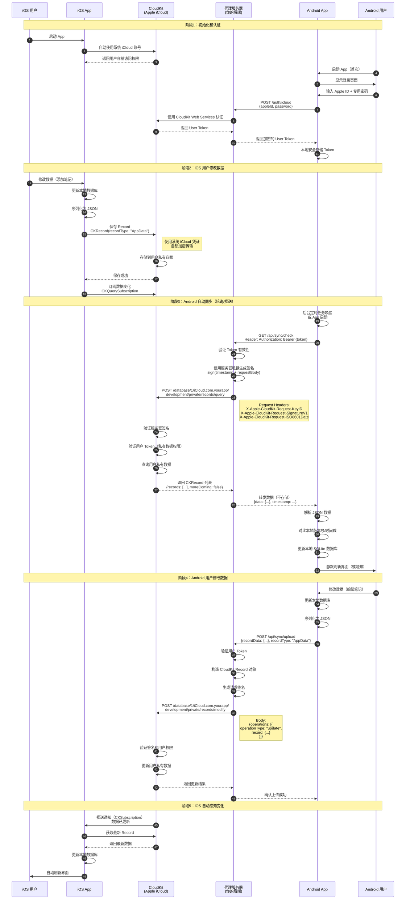

# 使用 iCloudKit 实现 ios app、android app 数据用户私有数据的流程。

```mermaid
sequenceDiagram
    autonumber
    participant iOSUser as iOS 用户
    participant iOSApp as iOS App
    participant CloudKit as CloudKit<br/>(Apple iCloud)
    participant Proxy as 代理服务器<br/>(你的后端)
    participant AndroidApp as Android App
    participant AndroidUser as Android 用户
    
    Note over iOSUser,AndroidUser: 阶段1：初始化和认证
    
    iOSUser->>iOSApp: 启动 App
    iOSApp->>CloudKit: 自动使用系统 iCloud 账号
    CloudKit-->>iOSApp: 返回用户容器访问权限
    
    AndroidUser->>AndroidApp: 启动 App（首次）
    AndroidApp->>AndroidUser: 显示登录页面
    AndroidUser->>AndroidApp: 输入 Apple ID + 专用密码
    AndroidApp->>Proxy: POST /auth/icloud<br/>{appleId, password}
    Proxy->>CloudKit: 使用 CloudKit Web Services 认证
    CloudKit-->>Proxy: 返回 User Token
    Proxy-->>AndroidApp: 返回加密的 User Token
    AndroidApp->>AndroidApp: 本地安全存储 Token
    
    Note over iOSUser,AndroidUser: 阶段2：iOS 用户修改数据
    
    iOSUser->>iOSApp: 修改数据（添加笔记）
    iOSApp->>iOSApp: 更新本地数据库
    iOSApp->>iOSApp: 序列化为 JSON
    
    iOSApp->>CloudKit: 保存 Record<br/>CKRecord(recordType: "AppData")
    Note right of CloudKit: 使用系统 iCloud 凭证<br/>自动加密传输
    CloudKit->>CloudKit: 存储到用户私有容器
    CloudKit-->>iOSApp: 保存成功
    
    iOSApp->>CloudKit: 订阅数据变化<br/>CKQuerySubscription
    
    Note over iOSUser,AndroidUser: 阶段3：Android 自动同步（轮询/推送）
    
    AndroidApp->>AndroidApp: 后台定时任务唤醒<br/>或 App 启动
    
    AndroidApp->>Proxy: GET /api/sync/check<br/>Header: Authorization: Bearer {token}
    
    Proxy->>Proxy: 验证 Token 有效性
    Proxy->>Proxy: 使用服务器私钥生成签名<br/>sign(timestamp + requestBody)
    
    Proxy->>CloudKit: POST /database/1/iCloud.com.yourapp/<br/>development/private/records/query
    Note right of Proxy: Request Headers:<br/>X-Apple-CloudKit-Request-KeyID<br/>X-Apple-CloudKit-Request-SignatureV1<br/>X-Apple-CloudKit-Request-ISO8601Date
    
    CloudKit->>CloudKit: 验证服务器签名
    CloudKit->>CloudKit: 验证用户 Token（私有数据权限）
    CloudKit->>CloudKit: 查询用户私有数据
    CloudKit-->>Proxy: 返回 CKRecord 列表<br/>{records: [...], moreComing: false}
    
    Proxy-->>AndroidApp: 转发数据（不存储）<br/>{data: {...}, timestamp: ...}
    
    AndroidApp->>AndroidApp: 解析 JSON 数据
    AndroidApp->>AndroidApp: 对比本地版本号/时间戳
    AndroidApp->>AndroidApp: 更新本地 SQLite 数据库
    AndroidApp->>AndroidUser: 静默刷新界面（或通知）
    
    Note over iOSUser,AndroidUser: 阶段4：Android 用户修改数据
    
    AndroidUser->>AndroidApp: 修改数据（编辑笔记）
    AndroidApp->>AndroidApp: 更新本地数据库
    AndroidApp->>AndroidApp: 序列化为 JSON
    
    AndroidApp->>Proxy: POST /api/sync/upload<br/>{recordData: {...}, recordType: "AppData"}
    
    Proxy->>Proxy: 验证用户 Token
    Proxy->>Proxy: 构造 CloudKit Record 对象
    Proxy->>Proxy: 生成请求签名
    
    Proxy->>CloudKit: POST /database/1/iCloud.com.yourapp/<br/>development/private/records/modify
    Note right of Proxy: Body:<br/>{operations: [{<br/>  operationType: "update",<br/>  record: {...}<br/>}]}
    
    CloudKit->>CloudKit: 验证签名和用户权限
    CloudKit->>CloudKit: 更新用户私有数据
    CloudKit-->>Proxy: 返回更新结果
    
    Proxy-->>AndroidApp: 确认上传成功
    
    Note over iOSUser,AndroidUser: 阶段5：iOS 自动感知变化
    
    CloudKit->>iOSApp: 推送通知（CKSubscription）<br/>数据已更新
    iOSApp->>CloudKit: 获取最新 Record
    CloudKit-->>iOSApp: 返回最新数据
    iOSApp->>iOSApp: 更新本地数据库
    iOSApp->>iOSUser: 自动刷新界面
```