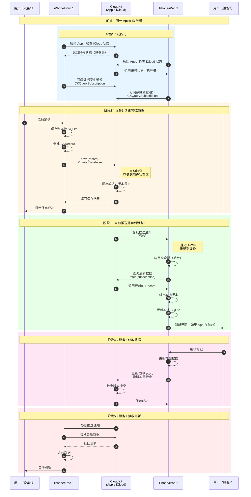

# 使用 iCloudKit 实现 ios 客户端数据用户私有数据的流程。

```mermaid
sequenceDiagram
    autonumber
    participant User1 as 用户（设备1）
    participant iOS1 as iPhone/iPad 1
    participant CloudKit as CloudKit<br/>(Apple iCloud)
    participant iOS2 as iPhone/iPad 2
    participant User2 as 用户（设备2）
    
    Note over User1,User2: 前提：同一 Apple ID 登录
    
    rect rgb(230, 245, 255)
        Note over iOS1,iOS2: 阶段1：初始化
        iOS1->>CloudKit: 启动 App，检查 iCloud 状态
        CloudKit-->>iOS1: 返回账号状态（已登录）
        
        iOS2->>CloudKit: 启动 App，检查 iCloud 状态
        CloudKit-->>iOS2: 返回账号状态（已登录）
        
        iOS1->>CloudKit: 订阅数据变化通知<br/>CKQuerySubscription
        iOS2->>CloudKit: 订阅数据变化通知<br/>CKQuerySubscription
    end
    
    rect rgb(255, 245, 230)
        Note over User1,User2: 阶段2：设备1 创建/修改数据
        User1->>iOS1: 添加笔记
        iOS1->>iOS1: 保存到本地 SQLite
        iOS1->>iOS1: 创建 CKRecord
        
        iOS1->>CloudKit: save(record)<br/>Private Database
        Note right of CloudKit: 自动加密<br/>存储到用户私有区
        CloudKit->>CloudKit: 保存成功，版本号+1
        CloudKit-->>iOS1: 返回保存结果
        iOS1->>User1: 显示保存成功
    end
    
    rect rgb(230, 255, 230)
        Note over User1,User2: 阶段3：自动推送通知到设备2
        CloudKit->>iOS2: 静默推送通知<br/>（后台）
        Note right of iOS2: 通过 APNs<br/>推送到设备
        
        iOS2->>iOS2: 应用被唤醒（后台）
        iOS2->>CloudKit: 查询最新数据<br/>fetch(subscription)
        CloudKit-->>iOS2: 返回更新的 Record
        
        iOS2->>iOS2: 对比本地版本
        iOS2->>iOS2: 更新本地 SQLite
        iOS2->>User2: 刷新界面（如果 App 在前台）
    end
    
    rect rgb(255, 230, 245)
        Note over User1,User2: 阶段4：设备2 修改数据
        User2->>iOS2: 编辑笔记
        iOS2->>iOS2: 更新本地数据
        
        iOS2->>CloudKit: 更新 CKRecord<br/>带版本号检查
        CloudKit->>CloudKit: 检查版本冲突
        CloudKit-->>iOS2: 保存成功
    end
    
    rect rgb(255, 235, 235)
        Note over User1,User2: 阶段5：设备1 接收更新
        CloudKit->>iOS1: 静默推送通知
        iOS1->>CloudKit: 拉取最新数据
        CloudKit-->>iOS1: 返回更新
        iOS1->>iOS1: 合并数据
        iOS1->>User1: 自动刷新
    end
```